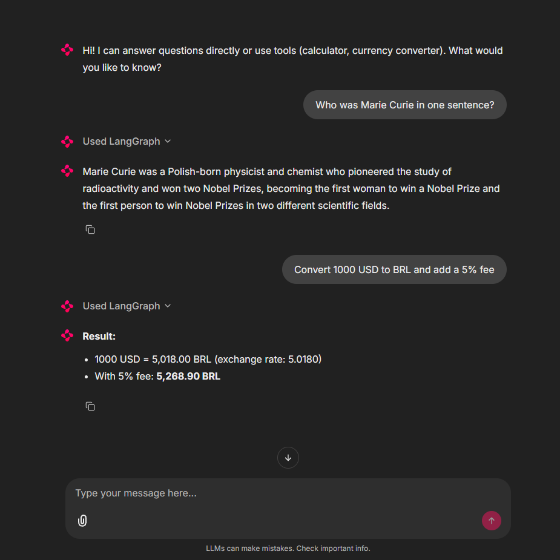
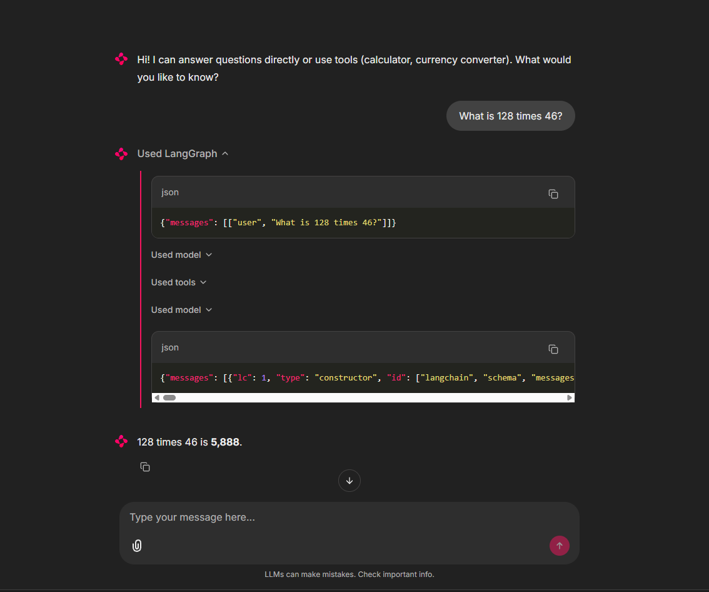
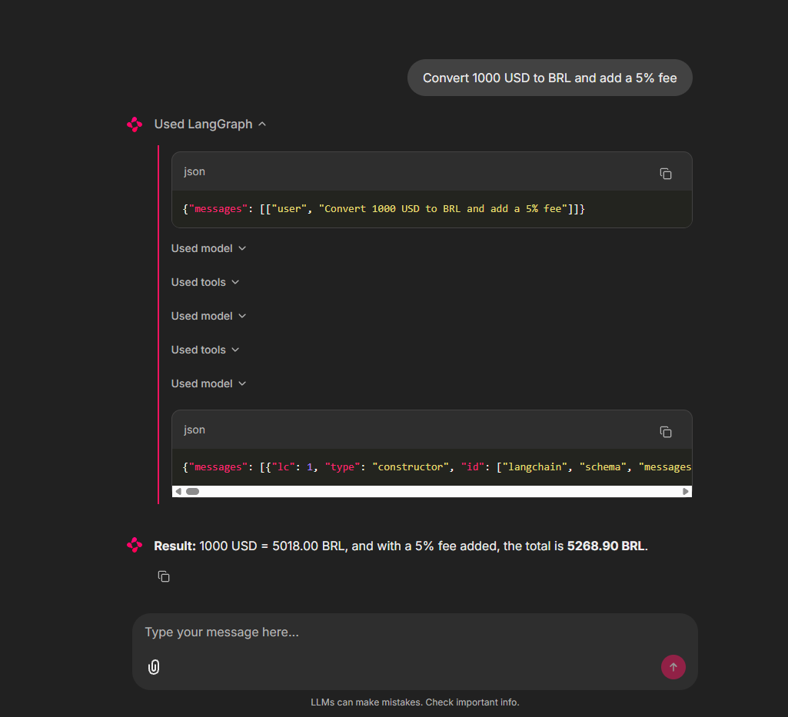

# AI Assistant with Tool Use

An AI assistant that picks between answering directly or calling tools (calculator, currency converter) based on what you ask. Built for Artefact's AI Engineer take-home.

Stack: LangGraph, LangChain, Claude Haiku, Chainlit.



## Quick start

You'll need Python 3.11+, [uv](https://docs.astral.sh/uv/), and an Anthropic API key.

```bash
git clone https://github.com/yagosamu/artefact-ai-assistant.git
cd artefact-ai-assistant

# Configure your API key
cp .env.example .env
# then edit .env and paste your ANTHROPIC_API_KEY

# Install (uv reads uv.lock so versions are reproducible)
uv sync

# Run the chat UI (opens at http://localhost:8000)
uv run chainlit run app.py
```

If you prefer the command line:

```bash
uv run artefact-ai-assistant "Convert 1000 USD to BRL and add a 5% fee"
uv run artefact-ai-assistant "What is 128 times 46?" --verbose
```

## How it works

```
┌──────────────┐    ┌──────────────────────┐    ┌──────────────────┐
│ User input   │ -> │ ReAct agent          │ -> │ Final answer     │
│ (UI or CLI)  │    │ (Claude + LangGraph) │    │                  │
└──────────────┘    └─────────┬────────────┘    └──────────────────┘
                              │ tool_use?
                    ┌─────────┼─────────┐
                    ▼                   ▼
            ┌──────────────┐    ┌──────────────────────┐
            │ calculator   │    │ currency_converter   │
            │ (safe AST)   │    │ (Frankfurter ECB)    │
            └──────────────┘    └──────────────────────┘
```

The agent follows the [ReAct pattern](https://arxiv.org/abs/2210.03629): at each step the LLM either calls a tool or returns the final answer. It's built with `langchain.agents.create_agent`, which compiles a state graph that loops model → tool → model until done.

Routing is delegated to the LLM, not hardcoded into a router. The system prompt describes when each tool is useful, and the model decides at inference time. Adding a new tool is one line (append to the `tools=[...]` list). The agent can also chain tools in a single turn: ask "convert 1000 USD to BRL and add a 5% fee" and watch it call `currency_converter` then `calculator`.

## Decisions and trade-offs

### LangChain + LangGraph (`create_agent`)

I've shipped two RAG-based SaaS with LangChain, so the patterns were already familiar. The real draw is the versatility: swapping `ChatAnthropic` for `ChatOpenAI` is one line. A native Anthropic SDK loop would be slightly cleaner for two tools, but locks you into one provider.

### Routing through the LLM, not a classifier

The brief uses "rotear" (route), which could imply a classifier ("is this math? then branch"). I delegate that decision to the LLM via tool descriptions. Adding a new tool is one line in `tools=[...]`. The composed query in the demo proves it: the agent calls `currency_converter`, reads the result, then calls `calculator` to apply the fee. None of that flow is hardcoded.

### AST-based calculator (not `eval()`)

The calculator parses expressions with Python's `ast` module and walks the tree, only allowing number literals and arithmetic operators. `eval()` would be a security hole (an LLM could pass `__import__('os').system(...)` and execute arbitrary code). AST gives the same expressiveness with no path to execution. The test suite has a `TestSafety` class that runs malicious payloads and asserts each one raises.

### Chainlit for the chat UI

Purpose-built for LLM chat. Ships with `LangchainCallbackHandler`, which renders each tool call as an expandable step automatically. Streamlit and Gradio would have meant building that view by hand. Vercel AI SDK would have meant learning a new stack mid-challenge.

### Frankfurter for the bonus tool

Finance is something I'm into, so currency conversion was a natural pick. It also composes with the calculator: "Convert 1000 USD to BRL and add a 5% fee" exercises both tools in one query. Weather or search would have been two unrelated tools side by side. [Frankfurter](https://frankfurter.dev/) uses ECB rates and needs no API key.

### Tools return strings, even for errors

Each tool catches its exceptions and returns a descriptive string instead of raising. If `currency_converter` hits a 422, it returns `"Error: API returned 422. Likely cause: invalid currency code."`. The LLM reads the error and can react gracefully. A raised exception would just crash the agent.

### Kept the tooling minimal on purpose

I default to mypy `--strict` and structlog in production. For a 36-hour take-home, those add ceremony that doesn't earn its keep. Kept ruff and pytest because they pay off immediately. Type hints are still used, just not enforced.

## Demo

Single tool call:



Composed query (`currency_converter` then `calculator`), five inner steps in one answer:



Same flow on the CLI:

```bash
uv run artefact-ai-assistant "Convert 1000 USD to BRL and add a 5% fee" --verbose
```

## Testing

```bash
uv run pytest -v
```

30 tests. The calculator has correctness checks plus a `TestSafety` class that runs malicious payloads and asserts each one raises. The currency tool mocks all HTTP via `respx`. None of the tests hit the real API, which is why they stayed green when Frankfurter changed domains mid-2025. The smoke script caught that drift, which is the right layer for it.

## What I learned

**Docstrings on `@tool` functions are prompts.** The text I write is exactly what the LLM reads to decide whether to call the function. Vague docstrings mean wrong routing.

**Tools should return string errors, not raise.** First version of the currency tool raised on Frankfurter errors and the agent crashed. Returning `"Error: ..."` lets the LLM see the failure and react (confirm with the user, try a workaround).

**Mocked unit tests and smoke tests catch different bugs.** When Frankfurter moved domains, my mocked tests stayed green. The smoke script caught it. Both layers have a job.

## What I'd do with more time

**Streaming responses.** Switching `agent.ainvoke()` for `agent.astream_events()` would push tokens to Chainlit as they arrive. Same total time, but feels much faster.

**Multi-turn memory.** A `checkpointer` plus `thread_id` would persist conversation history, so users could ask "and in EUR?" as a follow-up without restating context.

**LangSmith tracing.** Production debugging without traces is guesswork. LangSmith captures the full run per query (tools, args, latency, prompt) with just an env var, since the integration is built into LangChain.

## Project structure

```
artefact-ai-assistant/
├── app.py                            # Chainlit entry point
├── pyproject.toml                    # uv-managed deps, scripts, pytest config
├── uv.lock                           # pinned versions for reproducibility
├── chainlit.md                       # welcome page shown in the Chainlit UI
├── .env.example
├── src/artefact_ai_assistant/
│   ├── agent.py                      # build_agent() + SYSTEM_PROMPT
│   ├── cli.py                        # argparse + main()
│   └── tools/
│       ├── calculator.py             # safe AST evaluator + @tool wrapper
│       └── currency.py               # Frankfurter client + @tool wrapper
├── tests/
│   ├── test_calculator.py            # correctness + safety + tool wrapper
│   └── test_currency.py              # http (respx mocks) + tool wrapper
└── docs/screenshots/
```